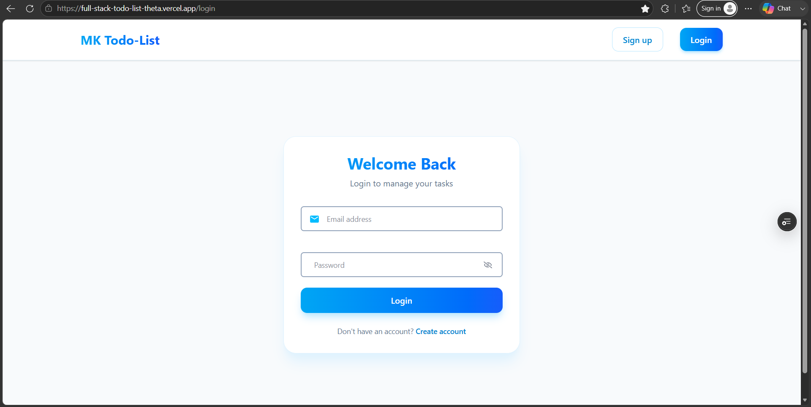
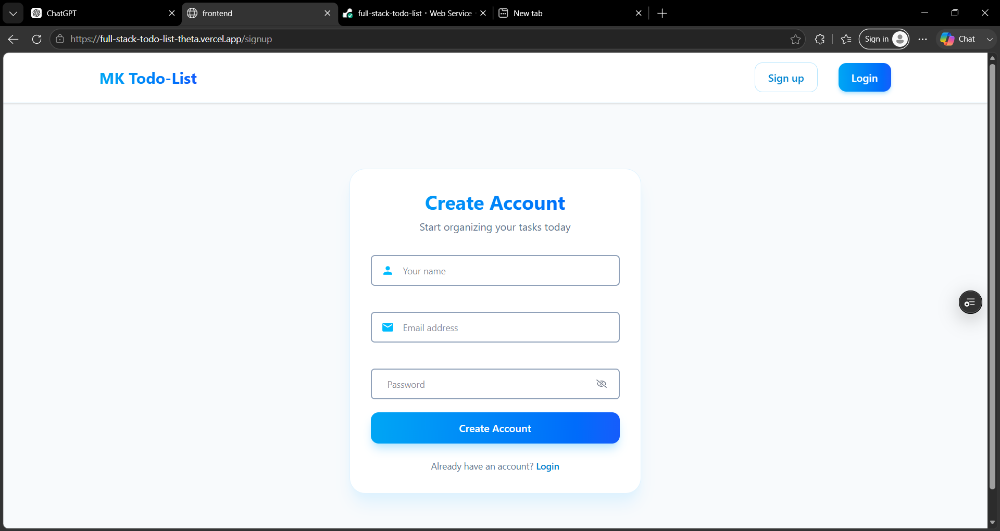
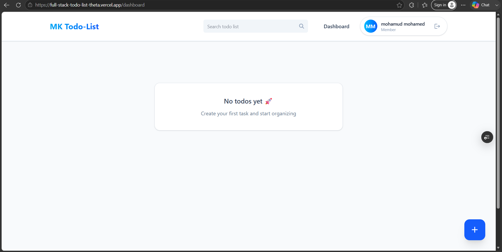
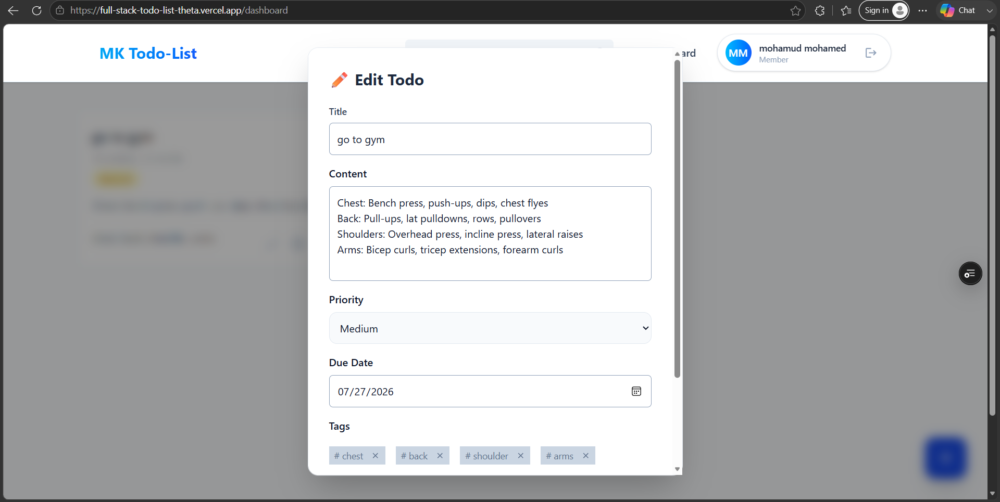
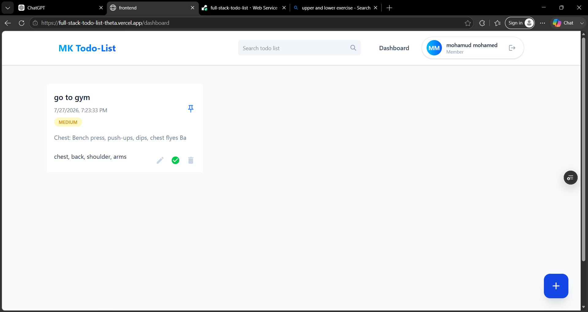

# Full Stack Todo List 🚀

A full-stack todo management application with authentication, task management, search, and user-specific todos.

## Live Demo

Frontend:
https://full-stack-todo-list-theta.vercel.app/login

Backend API:
https://full-stack-todo-list-vbw6.onrender.com

## Screenshots

### Login Page

### Signup Page

### Dashboard

### Creating Todo

### Todos Page

## Features

- User registration and login
- JWT authentication
- Create, edit, delete todos
- Mark todos completed
- Pin important todos
- Search todos
- Todo priority levels
- Due dates
- Responsive UI
- Dark mode support

## Tech Stack

### Frontend
- React
- Vite
- Tailwind CSS
- React Router
- React Hot Toast

### Backend
- Node.js
- Express.js
- MongoDB
- Mongoose
- JWT
- bcrypt

### Deployment
- Vercel
- Render
- MongoDB Atlas
